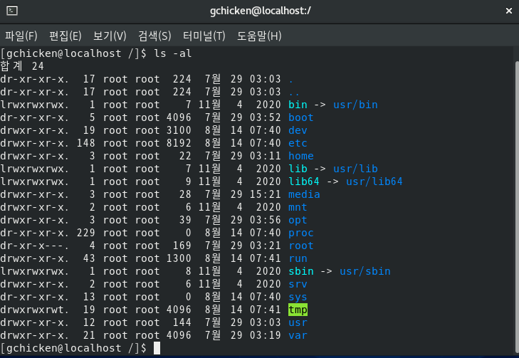
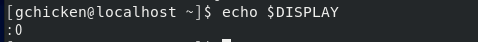
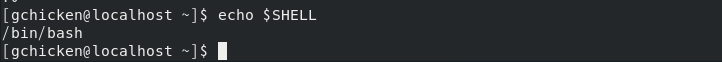
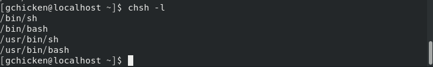
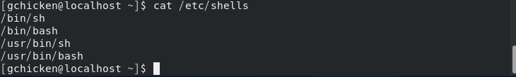
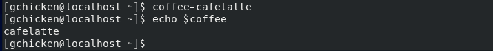
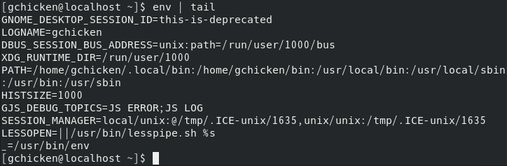

# 리눅스 시스템의 이해

## 목차

[2.1 하드웨어의 이해](#하드웨어의-이해)

### 2.1
### 하드웨어의 이해

    리눅스 설치 및 운영에 있어 CPU, 메모리, 하드디스크 등에 대한 정보는 필수 정보이다.

    CPU
        사용하고자 하는 배포판의 CPU 지원 여부를 확인해서 리눅스를 설치해야 한다.

    RAM (메모리)
        최근에는 대부분의 메모리를 잘 지원하여 종료에 따른 문제점은 거의 발생하지 않는다.
        그러나 메모리 용량은 정확히 알고 있어야 한다.
        스왑 파티션 설정과 관련있기 때문이다.

    하드 디스크 드라이브
        최근 리눅스 배포판에서는 대부분의 하드디스크 드라이브를 지원한다.
        그러나 어떤 디스크를 사용하는지는 알고 있어야 한다.
        왜냐하면 파티션이나 스왑 설정 등에서 하드디스크 종류에 따라 파일명이 달라진다.
        EX) IDE 디스크 : /dev/hdam, SCSI, S-ATA SSD 등 : dev/sda | /dev/sdb

    모니터와 비디오 어댑터
        텍스트 기반의 콘솔 환경에서는 모니터와 비디오 카드의 역할이 크게 중요하지 않다.
        그러나 X-Window 기반의 GUI 환경에서는 정확한 정보가 필요하다.

    네트워크 인터페이스
        리눅스는 네트워크 환경을 기반으로 사용하기 때문에 네트워크 인터페이스 설정은 필수이다.
        그러나 리눅스는 기본적으로 대부분의 네트워크 인터페이스를 지원한다.

    키보드 및 마우스
        리눅스는 현재 존재하는 키보드와 마우스를 대부분 지원한다.

### 2.2
### 하드웨어의 선택

    RAID (Redundant Array of Independent[Inexpensive] Disks)
        여러 개의 하드디스크가 있을 때 동일한 데이터를 다른 위치에 중복해서 저장하는 방법이다.
        데이터를 여러 개의 디스크에 저장하여 입출력 작업이 균형을 이루게 되어 전체적 성능 향상된다.
        운영체제에서 RAID는 논리적으로 하나의 디스크로 인식하여 처리된다.

    RAID 이용
    > 백업을 가능
    > 안정적인 데이터의 보존과 유지 가능
    > 속도향상

    RAID 기술
    1. 스트라이핑(Striping)
        연속된 데이터를 여러 개의 디스크에 라운드로빈 방식으로 기록하는 기술이다.

    2. 미러링(Mirroring)
        디스크에 에러가 발생 시 데이터의 손실을 막기 위해 
        추가적으로 하나 이상의 장치에 중복 저장하는 기술

### 2.3
### RAID의 종류

|종류|특징|단점|
|---|---|---|
|RAID-0|* 스트라이핑 기술을 사용하여 빠른 입출력 속도를 제공한다.  * 데이터를 중복이나 페리티 없이 디스크에 본산하여 기록한다.  * 처리속도가 빠르다|* 구성된 디스크 중에 하나라도 오류가 발생하면 데이터 복구가 불가하다.|
|RAID-1|* 미러링 기술을 이용하여 두 개의 디스크에 데이터를 동일하게 기록한다.  * 스트라이핑 기술은 사용안한다.  * 각 드라이브를 동시에 읽을 수 있어서 읽기 성능이 향상된다.|* 중복저장으로 인한 디스크 낭비가 50%에 이른다.  *  쓰기성능은 단일 디스크와 같다.|
|RAID-2|* 디스크들은 스트라이핑 기술을 사용하고 구성된다.  * 디스크들의 에러를 감지하고 수정하기 위해 ECC 정보를 사용한다.||
|RAID-3|* 스트라이핑 기술을 사용한다.  * 패리티 정보를 저장하기 위해 별도의 하나의 디스크를 사용한다.   보통 대형 레코드가 많은 시스템에서 사용된다.|* 입출력작업이 동시에 모든 디스크에 이루어 지기 때문에 입출력을 겹치게 할 수 없다.|
|RAID-4|* 블록 형태의 스트라이핑 기술을 사용하여 디스크를 구성한다.  * 데이터를 읽을 때 중첩 입출력이 가능하다. |* 쓰기작업은 패리티 연산을 해야되고 패리티 디스크에 저장해야되기 때문에 입출력의 중첩이 불가능하고, 병목현상이 발생할 수 있다.|
|RAID-5|* 최소 3개의 디스크로 구성해야 된다.  * 패리티 정보를 이용하여 하나의 디스크가 고장이 발생할 경우에도 사용이 가능한 방식이다.  * 구성된 디스크에 분산하여 기록하나, 중복저장하진 않는다.  * 가장 보편적이로 사용된다.  * 작고 랜덤한 입출력이 많은 경우에 더 나은 성능을 발휘한다.  * RAID-0,1 의 단점을 보완하였다.  * 디스크의 개수를 늘릴수록 저장 공간의 효율성이 높아진다.  * 1개의 디스크 오류에 대처 가능하다.|* 2개이상의 디스크 오류 발생 시 데이터를 복구 할 수 없다.|
|RAID-6|* 전체적인 구성은 RAID-5와 비슷하지만 디스크에 2차 패리티 구성을 포함함으로써 매우 높은 고장대비 능력을 발휘한다.  * 2개의 디스크 오류에도 데이터를 읽을 수 있다.  * RAID-5에 비하여 데이터에 대한 신뢰도가 높다.|* RAID-5 에 비하여 디스크 공간 효율성은 떨어진다.  * RAID-5에 비하여 처리속도가 떨어진다.|
|RAID-7|* 하드웨어 컨트롤러에 내장되어 있느 실시간 운영체제를 이용하여 구성하는 방식이다.  * 독자적인 여러가지 특성들을 제공한다.||
|RAID 0+1|* 디스크 2개를 RAID-0의 스트라이핑 기술로 구성 후 RAID-1의 미러링으로 구성하는 방식이다.  * 최소 4개의 디스크가 필요하다.||
|RAID-10|* RAID- 0+1의 반대 개념으로써 디스크 2개를 미러링으로 구성 후 다시 스트라이핑 하는 방식이다.||
|RAID-53|* RAID-3 방식에 별도로 스트라이프 어레이를 구성하는 방식이다.  * RAID-3 보다 높은 성능을 제공한다.|* 구성 비용이 많이 든다.|

### 2.4
### LVM

    LVM (Logical Volume Manager) 개요
    여러 하드 디스크의 파티션을 분할 및 병합 하는 기능이다.

    용어
    1. 물리적 볼륨 (PV:Physical Volume)
        실제 디스크에 물리적으로 분할한 파티션이다.
    2. 볼륨그룹 (VG:Volume Group)
        물리적 볼륨이 모여서 생성하는 덩어리다.
        PE가 모여서 생성되는 하나의 큰 덩어리이다.
    3. 논리적 볼륨 (Logical Volume)
        VG 에서 사용자가 필요한 만큼 할당하여 만들어지는 공간이다.
        물리적 디스크에서 분할하여 사용하는 파티션이라고 보면된다.
    4. 물리적 확장 (PE:Physical Extent)
        PV 에서 나누어 사용하는 일종의 블록 같은 영역이다.
        보통 1 PE 가 4 MB 정도씩 할당된다.

### 2.5
### 리눅스의 구조

    부트매니저
        부트 로더라고 불리기도 하며, 부팅을 도와주는 역할을 하는 프로그램으로 특히 한 컴퓨터에 
        리눅스, 윈도우 등 운영체제가 설치되어 있을 경우에 선택하여 부팅할 수 있도록 해준다.
        하드디스크의 MBR(Master Boot Record) 에 설치된다.

    LILO (Linux Loader)
        리눅스용 부트 매니저 프로그램이다.
        최근에는 잘 사용 안한다.

    GRUB (Grand Unified BootLoader)
        GNU 프로젝트에서 만든 부트로더이다.
        다양한 파일 시스템을 지원한다.
        부팅 시 커널인자를 조정하여 동적인 부팅을 지원한다.
        그래픽 매뉴와 배경그림 삽입이 가능하다.

    GRUB의 부트화면
        그래픽 메뉴 목록 형식으로 지원된다.
        레드헷 계열에서는 하나의 운영체제만 설치되어있을 시 목록을 보여주지 않는다.
        위의 경우, 특정 키를 입력해야 GRUB 부트화면에 접근 할 수 있다.
        제시된 목록에서 상하 방향키를 통해 OS를 바꿀 수 있고 [Enter] 키를 통해 선택 및 부팅한다.
        메뉴 화면에서 [a], [e], [c] 키를 통해 커널인자를 조정을 통한 다양한 부팅모드를 제공한다.

    [a] 키
    grub.conf 에서 kernel과 관련된 부분의 매개 변수를 추가할 수 있게 해준다.
    [a]키 입력 후, 맨뒤에 single 또는 1을 입력하여 싱글모드로 진입할 수 있다.

    [e] 키
    grub.conf에 등록된 부팅 목록의 모든 항목을 직접 편집할 수 있도록 해준다.
    편집중 [ESC] 키를 통해 초기값으로 바꿀 수 있다.
    메뉴를 편집한다해서 grub.conf의 내용이 바뀌는 것이 아닌 현재 부팅시에만 일시적으로 적용된다.
    편집모드에서 지원하는 키
        e : 커서가 위치한 줄을 편집한다.
        d : 커서가 위치한 줄을 삭제한다.
        o : 명령줄을 커서가 위치한 줄의 아래에 추가한다.
        O : 명령줄을 커서가 위치한 줄의 위에 추가한다.
        b : 부팅을 시작한다. (최종 편집 후 부팅할 때 사용)
    
    [c] 키
    상호대화식으로 직업 입력할 수 있는 모드이다.
    사용방법은 명령어를 입력하는 환경이 Bash Shell과 유사하다.

    grub.conf
        #boot=/dev/sda 
            부팅이 되는 하드디스크를 지정하는 항목이다.
            시스템에 장착된 디스크가 하나인 경우 주석처리된다.
        default=0
            전원을 켰을 때 기본적으로 부팅되는 운영체제를 설정하는 항목
            GRUB 메뉴화면에서 선택하지 않았을 때 이 값을 기준으로 선택된다.
            이 값은 grub.conf에 나열된 title 순이다.
        timeout=10
            GRUB 메뉴화면에서 대기 시간으로 단위는 초이다.
            대기시간이 지나면 default의 OS가 부팅된다.
            이 부분이 주석처리되거나 항목이 없으면 반드시 [Enter] 키로 선택해야 부팅된다.
        splashimage=(hd0,3)/boot/grub/splash.xpm.gz
            GRUB 화면의 배경 이미지를 지정하는 부분이다.

### 2.6
### 디렉터리 구조 및 역할

    디렉터리(Directory)의 개요
    리눅스에서 디렉터리는 최상위에 해당하는 루트(/)중심으로
    하위 디렉터리에 다수의 디렉터리가 존재하는 형태의 트리구조로 계층적으로 관리된다.

    /           : 최상위에 있는 디렉터리로 루트 디렉터리라 한다.

    /bin        : 일반적으로 bin은 binary의 약자로 실행 파일들이 들어있다.
                > cp, mkdir, mv, rm 등의 명령어 들이 들어있는 디렉터리로 보통 PATH가 설정되어있다.

    /boot       : 부팅 이미지 파일이나 커널 등 시스템 부팅 시 필요한 파일, grub 관련 파일이 들어있는 파일이다.

    /dev        : 하드디스크, CD-ROM, 터미널 등과 같이 
                > 실제로 존재하는 물리적인 장치 등을 파일화해 관리하는 디렉터리이다.

    /etc        : 이 디렉터리에는 시스템 환경 설정 파일 및 부팅과 관련된 여러 가지 스크립트 파일들이 들어있다.
                > 이들 파일에 설정된 내용을 읽어서 관련 프로그램들이 실행하게 된다.

    /home       : 개인 사용자들이 파일이나 디렉터리를 만들어서 사용할 수 있는 홈 디렉터리가 위치한다.

    /lib        : 각종 라이브러리가 저장되어 있는 디렉터리로 커널 모듈도 이 디렉터리에 들어있다.

    /mnt        : CD-ROM, 플로피디스크, 하드디스크, 네트워크 파일 시스템 등을 마운트할 때 포인터가 되는 디렉터리이다.
                > 최근 버전에는 /media, /net 등을 추가로 제공하고 있다.

    /misc       : 자동 마운트 프로그렘인 autofs에 의해 사용되는 디렉터리이다.

    /opt        : 응용 프로그램들의 설치를 위해 사용되는 디렉터리이다.

    /proc       : 가상 파일 시스템으로 시스템에서 운영되고 있는 다양한 프로세스의 상태, 하드웨어, 기타 시스템 정보를 가지고 있다.

    /root       : 시스템 관리자인 root 사용자의 홈 디렉터리이다.
    
    /sbin       : System Binary의 약자로, 주로 시스템 관리에 대한 명령어들이 들어있는 디렉터리이다.
                > 보통 root 사용자가 사용하며, 시스템종료, 네트워크 인터페이스 설정, 시스템 점검 및 복구 등의 명령들이 들어있다.

    /tmp        : 임시 저장 디렉터리로서 각종 프로그램이나 소켓파일, 프로세스 작업을 할 때 
                > 임시로 생성되는 파일을 저장하는 디렉터리이다.

    /usr        : 시스템 운영에 필요한 명령, 응용 프로그램들이 위치하는 디렉터리이다.
                > 커널소스, C 언어 헤더 파일, C-컴파일러와 같은 개발도구 ,MYSQL 등이 모두 이 디렉터리 하위 디렉터리에 설치된다.
    /var        : 시스템 운영 로그 파일과 스풀링과 같은 가변적인 데이터를 보관하는 디렉터리이다.

    /media      : 이동식 장치인 cdrom, floppy 등을 마운트 하기 위해 제공되는 디렉터리이다.

    /selinux    : RHEL 4 부터 보안 강화를 위해 사용되는 SELLinux 관련 디렉터리이다.

    /srv        : 사이트에서 생성되는 데이터를 저장하는 디렉터리이다.
    
    /sys        : 2.6 커널에서 사용되는 가상 파일 시스템인 sysfs에서 사용하는 디렉터리이다.
                > proc디렉터리에서 보다 계층적인 구조로 하드웨어 정보를 제공한다.

    /cgroup     : cgroup(control group)은 시스템 상에 동작중인 태스크들을 임의로 그룹지어 제어할 수 있도록 
                > 도와주는 기능을 제공하는데, 이와 관련된 정보를 담고 있는 디렉터리이다.

    /lib64      : 64비트용 리눅스를 설치하는 경우에 생성되는 디렉터리로 64비트 기반의 라이브러리 관련 디렉터리이다.

    /run        : 부팅 이후에 동작중인 프로세스의 런타임(Runtime) 데이터를 저장하고 있는 디렉터리이다.

### 2.7
### 부팅과 셧다운

    부팅은 컴퓨터의 전원이 켜진 후 운영체제가 가동되어 사용자가 컴퓨터를 사용할 수 있도록 만들어주는 과정이다.
    부팅은 두 가지의 단계를 거친다.
    1. 하드웨어적 단계
        시스템에 장착된 하드웨어를 인식하고 점검하는 단계
    2. 소프트웨어적 단계
        사용자가 운영체제를 사용하고 다양한 응용 프로그램을 사용할 수 있도록 메모리에 상주시키는 단계

    
    하드 디스크에 설치된 운영체제의 부팅과정
    
    1. 컴퓨터 전원을 켜면 바이오스는 컴퓨터에 장착된 하드웨어를 점검한다.
    2. 바이오스는 하드웨어가 검사가 끝나면 CMOS에 설정된 첫 번째 부팅 하드디스크를 확인한다.
    3. 첫 번째 하드디스크의 MBR 영역에 있는 부트 매니저 프로그램을 실행한다.
    4. 부트 매니저 프로그램은 관련 환경 설정 파일을 참고하여 운영체제 부팅을 시작한다.

    리눅스의 부팅 과정

    1. 리눅스 부팅의 하드웨어 인식 단계
    부트 매니저 프로그램인 grub가 시작되면 리눅스 설치 시에 인식된 하드웨어 설정대로 부팅을 진행한다.

    2. 리눅스 부팅의 소프트웨어 구동 단계
    리눅스 시스템 부팅 시 커널이 로드되면 커널은 우선 루트 파일 시스템(/)을 읽기 전용 형태로 마운트한다.
    그 다음, 검사 후 이상이 없으면 쓰기 가능 형태로 다시 마운트 한다.
    그 후 커널은 /etc/init안의 환경설정파일을 읽어 init 프로세스를 발생시킨다.

    init 관련 환경설정 파일은 다음과 같다.
    /etc/inittab        : 부팅과 관련된 실행 레벨이 정의되어 있다.
    /etc/init/rcS.conf  : 시스템 초기화와 관련된 내용이 정의되어 있다.
                          호스트명 설정, 시스템 점검, RAID 및 LVM 장치 활성화 등을 한다.
    /etc/init/rc.conf   : 부팅 시 각 레벨별로 진행되는 내용이 설정된 파일이다. rcS.conf에 의해 실행된다.
    /etc/rc.d/rc.local  : 실행 레벨 2,3,5에서 가장 마지막에 실행되는 파일이다.
                          보통 사용자가 부팅시에 필요한 서비스를 구동할 때, 이파일안에 등록하여 사용한다.

    실행 레벨
    init 데몬에 의해 수행되어질 내용이나 시스템 초기화 등을 정의해둔 여러가지 모드를 뜻한다.

    레벨 0  : 시스템의 중지(종료)할 때 호출되는 레벨이다. (기본값 설정 금지)
    레벨 1  : 단일 사용자 모드로 로그인과정 없이 root 사용자로 부팅하여 일종의 관리자 모드역할을 한다.
              네트워크, 서버, 파일 공유 등과 같은 서비스를 하지 않는다.
              보통 root 암호 분실, 파일 시스템 점검 및 복구, 시스템 점검 등 시 접근한다.
    레벨 2  : 네트워크를 사용하지 않는 다중 사용자 모드이다.
    레벨 3  : 네트워크를 사용하는 다중 사용자모드이다. X 윈도를 사용하지 않는다. 메모리 효율에 좋다.
    레벨 4  : 일반적으로 사용되지 않는다. 그러나 사용자가 정의하여 사용가능하다.
    레벨 5  : X 윈도를 사용하는 다중 사용자 모드로, 최근 배포판에서 기본적으로 설정되는 레벨이다.
    레벨 6  : 시스템을 재부팅할 때 호출되는 레벨이다. (기본값 설정 금지)

    로그인
    리눅스는 다수의 사용자가 사용할 수 있는 운영체제이기 때문에
    설정한 ID, PW를 입력하는 로그인절차가 반드시 필요하다.

    로그인 메시지 관련 파일    
    /etc/issue      : 사용자가 로그인할 때 'login: '이라는 메시지를 보여주기전에 출력되는 내용을 적는 파일이다.
    /etc/issue.net  : /etc/issue과 역할은 같지만 위는 로컬 터미널로 접속시, 이것은 텔넷을 통한 접속시 적용된다.
    /etc/motd       : 성공적으로 로그인되었을 때 접속된 사용자에게 보여주는 메시지를 기록한다.

    로그아웃
    리눅스에서 로그인만 하고 로그아웃을 하지 않으면 
    자원이 낭비되는 것 뿐먼 아니라 보안상의 위험이 발생할 수 있기 때문에 반드시 로그아웃을 하여야 한다.

### 2.8
### root 비밀번호 분실 시 복구방법

    1. 재부팅하여 grub 부트 메뉴로 접속한다. 부팅 초기화면에서 e 입력시 접속가능하다.
    2. 해당 운영체제를 선택 후 a 키를 눌러 커널어규먼트에서 줄의 끝을 single 또는 1로 수정한다
    3. 단일 사용자 모드로 접속 후 password 명령어를 통해 패스워드를 수정한다.

### 2.9
### GRUB, root 패스워드 분실 시 복구법

    1. 설치 디스크를 이용해 부팅을 한다.
    2. 응급 복구 모드 (Rescue installed system)을 선택한다.
    3. 기본 선택 (언어서택 English, 키보드 us, 네트워크 no, 마운트여부 Continue, 셸 호출 Start shell)
    4. 설치된 리눅스 시스템이 /mnt/sysimage 디렉터리로 마운트된다.
    5. 루트 디렉터리를 변경한다. (chroot /mnt/sysimage)
    6. /boot/grub/grub.cont 파일을 열어 password 항목을 삭제한다.
    7. 재부팅하여 패스워드를 복구한다.

### 2.10
### 시스템 종료 (shutdown)

    셧다운이란 시스템의 전원을 끄거나 종료하는 행위를 일컫는다.

    shutdown 명령어
        시스템을 재시작하거나 종료하는 명령어로써 root 권한자만 가능하다.
        비교적 안전하고 조직적인 방법으로 시스템을 종료하거나 재부팅할 수 있다.

        shutdown [options] [time] [warn]
        Ex) shutdown -r +10 "wtf"

        options
        -r  : 시스템을 재부팅할 때 사용한다. (reboot)
        -h  : 시스템을 종료할 때 사용한다. (halt)
        -c  : 예약된 셧다운 명령을 취소한다.
        -k  : 실제로 셧다운하진 않고 경고 메시지만 접속 사용자들에게 전송한다.

        time
        단위는 분이다. 예로써 이 값이 10이면 10분을 의미한다.
        xx:yy 같은 형태일 때 x는 시간 y는 분을 의미한다.
        now 는 지금즉시를 뜻한다.
        
        warn
        경고메시지 부분이다.

    reboot 명령어
        시스템을 재시작하는 명령어이다.
        로컬 접속 사용자면 모두 사용가능하다.

        reboot [option]
        Ex) reboot

        option
        -w  : 시스템을 재부팅하진 않고 /var/log/wtmp 에 셧다운한 기록만을 저장한다.

    halt 명령어
        시스템을 종료하는 명령어이다.
        로컬로 접속한 사용자라면 모두 사용가능하다.

        halt [option]
        Ex) halt

        option
        -p  : 시스템 종료 후 전원까지 끄는 경우에 사용한다. (power off)

    poweroff 명령어
        시스템 종료 및 전원을 끄는 명령어이다.
        Ex) poweroff
    
    init, telinit 명령어
        이 명령은 모든 프로세스의 조상인 init 프로세스에 직접 요청해 실행레벨을 변경할때 사용한다.
        위에서 봤지만 실행레벨 0(종료), 6(재부팅)을 이용한다.
        빠르게 실행되지만, 실행중인 프로세스를 무조건적으로 종료함으로 권장하진 않는다.

        init [LV]
        Ex) init 0

### 2.11
### 리눅스 파일 시스템의 이해

    파일 시스템이란 운영체제가 파티션이나 디스크에 데이터를 저장, 읽고, 쓰고, 찾기 위해 구성하는 일련의 체계를 의미한다.

    파일 시스템의 기능
        * 사용자가 파일을 생성 수정 삭제할 수 있도록 제공
        * 사용자가 파일을 사용하기 적합한 형태의 구조로 구성하고 다양한 추가 정보 제공
        * 다른 사용자와의 파일을 공동으로 사용할 수 있는 적절한 제어방법 제공
        * 파일 공유를 위해 판독 접근, 기록 접근, 수행 접근 등의 다양한 접근 제어 방법 제공
        * 정보 손실이나 파괴를 방지하기 위해서 백업이나 복구를 위한 기능 준비
        * 사용자와 장치간의 독립성을 유지하기 위해 사용자가 물리적인 장치 이름대신에 적절한 이름 제공
        * 정보가 안전하게 보호되고 비밀이 보장될 수 있도록 정보의 암호화 및 복호화 기능 제공
        * 사용자가 파일이나 디렉터리에 접근하기 쉬운 인터페이스 및 명령어 제공

    리눅스의 파일 시스템
    현재 대부분의 리눅스에서는 ext4 파일시스템을 이용하고 있다.
    또한 ext2, ext3, ext4, nfs, Reiser FS, XFS, JFS 등이 있다.

    저널링 파일 시스템(Journaling File System)
    파일 시스템에 대한 변경사항을 반영하기 전, 저널이라 부르는 로그에 변경사항을 저장하여 및 추적이 가능하게 만든 시스템이다.
    비정상적인 종료에도 로그를 사용해 빠르고 안정적인 복구를 제공한다.

    아이노드(Inode)
    전통적인 유닉스 계열 파일시스템에서 사용하는 일종의 자료구조이며 각각의 파일은 하나의 아이노드를 할당받아 관리된다.
    아이노드 넘버, 접근권한, 파일형식, 소유자정보, 파일크기, 타임스템프 등의 정보를 저장한다.

    파일 시스템 특징들
    minix   : 1987 > 초기 리눅스 파일 시스템의 모태 
                     파티션 사이즈 64MB 제한, 파일이름 14자 제한 단일 타임스템프 체제
    ext     : 1992 > UFS를 기반, 파티션 2GB, 파일명 255 지원
                     파일접근에 대한 타임스템프, 아이노드 수정 지원안함
    ext2    : 1993 > ext 다음버전, 타임스템프, 아이노드 지원 문제 해결
                     이론적으로 16GB 단일파일 생성, 최대 4TB파일시스템 구성가능하나, 호환성문제로 2GB 파일생성 지원
    ext3    : 2001 > ext2 의 확장판, 이론적으로 최대 2TB 단일파일생성, 16TB 파일시스템 구성 가능
                     리눅스의 대표적인 저널링 파일 시스템, ACL를 통한 접근제어 지원
    ext4    : 2006 > ext2, ext3 과 호환성있는 확장판 64비트 기억공간 제한을 앲앰
                     최대 1EB 디스크볼륨 및 16TB 파일 지원등의 대형파일 시스템 기능 대폭 강화
    XFS     : 1993 > SGI에서 개발한 저널링 파일 시스템, 16EB디스크 볼륨, 8EB 파일 지원
    
    Reiserfs: 독일의 한스라이너가 개발한 저널링 파일 시스템
    JFS     : IBM에서 개발한 저널링 파일 시스템
    xiafs   : minix 파일 시스템 안정성을 강화하여 만듦, 현재는 리눅스에서 제외
    msdos   : MS-DOS의 FAT 파일 시스템과 호환되도록 지원하는 파일시스템, 파일이름 8자, 확장자 3자까지 지원
    umsdos  : 리눅스에서 MS-DOS 파일 시스템을 확장하여 만든것, 긴파일명, UID/GID, POSIX 허가권, 특수파일 등 지원
    vfat    : MS의 FAT-32 파일 시스템과 호환되도록 지원하는 시스템
    isofs   : ISO 9660인 CD-ROM 메체를 위한 파일 시스템
    nfs     : 네트워크 상의 시스템 파일들을 공유할 때 사용하는 파일 시스템
    smb     : 네트워크 파일 시스템인 SMB 프로토콜을 구현한 파일시스템, 현재에는 CIFS로 확장
    ncpfs   : Novell Netware에서 사용하는 네트워크 파일 시스템인 NCP프로토콜을 구현한 파일시스템
    sysv    : SystemV/Coherent 파일 시스템을 리눅스에 구현한 것, XenixFS, SystemV/386FS, Coherent FS 등 지원
    proc    : 리눅스에서 사용하는 가상 파일 시스템, 커널과 관련된 데이터를 담는 영역

    리눅스 파일 시스템의 구조
    
    일반적으로 디스크 드라이브 이용시의 형태

    i-list 와 Directory Blocks and Data Blocks 관계

    Format(mkfs)
    Disk Dirve  [Partition] [Partition] [Partition]
    
    Filesystem
    Partition   [Boot Block] [Super Block] [i-list] [Directory Blocks and Data Blocks]
    
    Directory Blocks and Data Blocks
                [Data Block] [Data Block] [Data Block] ... [Directory Block]
                     ↑            ↑             ↑
    i-list        [i-node]     [i-node]      [i-node] ... [i-node]
                      ↑
    Directory Block [[i-node number], [file name]] [[i-node number], [file name]] ...

    리눅스 파일 시스템은 보통 ext4 를 사용한다. 
    그렇지만 ext4는 ext2를 기반으로 확장된 파일 시스템임이므로 ext2 구조를 보자

    Format(mkfs)
    Disk Drive  [MBR] [Reserved] [Partition 1] ... [Partition N]

    Filesystem  [Boot Block] [Block Group 0] [Block Group 1] ... [Block Group N]

    Block Group [Super Block] [Group Descriptors] [Block Bitmap] [Inode Bitmap] [Inode Table] [Data Blocks]

    Super Block     : 파일 시스템에 대한 전체적인 정보를 가지고 있다. 
    Block Bipmap    : 블록의 사용 현황을 비트로 표현해준다.
    Inode Bipmap    : 아이노드 할당 상태를 비트로 표현해준다.
    Inode Table     : 파일이나 디렉터리 관리를 위해 아이노드라는 것을 사용하는데. 이 아이노드에 대한 정도박 들어있는 영역이다.

### 2.12
### X 윈도
    
    X Window
    * 네트워크 프로토콜에 기반을 둔 그래픽 사용자 인터페이스 환경이다.
    * 클라이언트/서버 구조로 되어 있다.
    * 서로간의 통신을 위해 X Protocol을 사용한다.
    
    [Keyboard] [Mouse] [Screen]
    [    ↓        ↓       ↑
        [---------X Server----------] ─────────────┐
            ↕                 ↕                    │
        [X client(browser)] [X client(xterm)]     // Network
    ]                      Remote machine [X client(xterm)]

    Xlib와 X 관련 라이브러리
    Xlib는 C언어로 구현된 클라이언트 라이브러리로 X 서버와 대화를 해주는 역할을 한다.
    개발자들은 관련 프로토콜에 관한 자셓나 정보 없이도 Xlib를 통해 다양한 프로그램을 구현할 수 있게 된다.

    XFree86 : IBM 호환 시스템을 사용하는 유닉스 계열 운영체제를 위한 X 윈도 프로젝트이다.
    X.org   : X.org Foundation에서 관리되는 X 서버 패키지로 보통 X.org Server라 부른다.

### 2.13
### 데스크톱 환경

    데스크톱 환경이란 GUI 환경을 이용하기 위해 사용자에게 제공되는 인터페이스 스타일을 말한다.
    보통 리눅스 환경에서는 GNOME, KDE, Xfce, LXDE 등이 있다.

    KDE (K Desktop Enviroment)
    * 마티아스 에트리히가 Qt 라이브러리를 기반으로 만들었다.
    * GPL 라이선스이다.
    * FreeBSD, Solaris. Microsoft Windows, OS X 등도 자원한다.

    GNOME (GNU Network Object Model Emviroment)
    * GNU에서 만든 공개형 디스크톱 환경이다
    * GTK+ 라이브러리를 사용하여 개발되었다.
    * LGPL, GPL을 따른다
    * 재사용이 쉽도록 코드를 공개하였고, 특별한 기술 없이도 손쉽게 사용할 수 있도록 만들어진다.
    * GNOME 초기에는 nautilus 파일관리자를 사용했다.
    * GNOME 2 에는 metacity라는 윈도 매니저를 사용했다.
    * GNOME 3 Mutter(GNOME Shell)이라는 윈도매니저가 사용되고있다.

### 2.14
### 윈도 매니저

    윈도 매니저는 X 윈도 환경에서 윈도의 배치와 표현을 담당하는 시스템 소프트웨어이다.
    창 여닫기, 최소화 및 최대화, 이동, 크기조정 등의 기능, Dock, Task bar, Program launcher 등의 유틸도 제공한다.

    [user] <-> [graphical interface] <-> [display server] <-> [kernel] <-> [hardware]
                                                          <-> [window manager]

    윈도 매니저의 종류
    Mutter      : GNOME3
    Metacity    : GNOME2
    Kwin        : KDE

### 2.15
### X 윈도 활용

    X 윈도는 X서버와 X 클라이언트가 독립적으로 동작하는 네트워크 지향 시스템이다.
    때문에 원격지의 X 클라이언트를 다른 시스템의 X 서버에서 실행시킬 수 있다.
    이 때 사용하는 xhost이다.
    또한 X 클라이언트에서 원격지의 X 서버에 프로그램이 전달되기 위해서는
    실행되는 터미널이 정의되어있는 환경 변수인 DISPLAY를 수정해야 한다.

    xhost : X 서버에 접근할 수 있는 클라이언트를 지정하거나 해제하는 명령이다.
        # xhost [+|- defualt = +] [IP주소 또는 도메인명] 
        
        # xhost
        => 현재 설정된 접근 목록을 출력

        # xhost +
        => 모든 클라이언트의 접속을 허용

        # xhost -
        => 모든 클라이언트의 접속을 차단

        # xhost + 192.168.12.22
        # xhost 192.168.12.22
        => 192.168.12.22의 접속을 허가한다.

        # xhost - 192.168.12.22
        => 192.168.12.22의 접속을 차단한다.

    DISPLAY : X 클라이언트 프로그램이 실행될 때 표시되는 창이 설정되어 있는 환경 변수이다.

        :x.y

        x는 시스템에 실행되고 있는 첫 번째 x윈도 값
        y는 첫 번째 모니터 값

        # export DISPLAY="203.247.51.100:0.1"
        => X 클라이언트 프로그램을 203.247.51.100의 첫 번째 실행된 X 서버의 두 번재 모니터로 전송한다.

    xauth : 접근 허가 파일 관련 도구이다.

### 2.16
### 응용 프로그램

    GIMP : 사진이나 그림을 편집하는 자유 소프트웨어이다.

    Totem : GNOME 데스크톱 기반의 Movie Player 이다.

    KMid : 미디 및 노래방 파일 플레이어이다.

    ImageMagick : 비트맵 이미지를 보여주고, 생성 및 편집이 가능하도록 지원해주는 프로그램 패키지 이다.

    eog: Eye of GNOME의 약자로, GNOME 데스크톱에서 제공하는 이미지 뷰어 프로그램이다.

    kdegraphics : KDE에서 제공하는 그래픽관련 프로그램 패키지이다.

    Rhythmbox : GStreamer Media Framework에 기반을 둔 통합형 음악 관리 프로그램이다.

    envince : 멀티 페이지 문서 뷰어 프로그램이다.

    LibreOffice : 무료로 배포되는 오피스 프로그램 패키지이다.

### 2.17
### 셸 Shell

    셸은 커널과 사용자 간의 다리 역할을 하는것이다.
    다시 말하면사용자로 부터 명령을 받아 그것을 해거하고 프로그램을 실행하는 역할을 한다.
    리눅스는 sh를 기본으로 ksh와 csh 계열의 장점을 결합한 bash(Bourne Again shell)을 표준으로 하고 있다.

    주요 셸 종류 및 특징
    * Bourne Shell  : 유닉스 버전 7의 기본 셸이다.
    * bash          : 본셸을 기반으로 만들어졌으며 현재 리눅스의 표준 셸이다.
                      sh와 호환되고. ksh, csh의 유요한 기능들을 참고하였다.
                      명령 히스토리, 명령어 완성기능, 히스토리 치환, 명령행 편집 등을 지원하고 POSIX와 호환된다.
    * csh           : C셸이라 불리며, C언어를 기반의 프로그램에 대하여 강력한 프로그램 작성 기능을 가지고있다.
                      히스토리기능, 별명, 직접제어등의 기능을 가지고있다.
    * tcsh          : TENEX 라는 운영체제의 명령행 완성기능과, C shell을 통합해서 만들어졌다. (The enhanced C shell)
                      명령어 완성기능, 명령행 편집 기능을 추가 지원한다.
    * ksh           : 콘셸이라고 불리며 본셸을 확장판이며 C shell 의 많은 기능이 추가되었다.
                      작업제어, 앨리어스, 히스토리, Vi, 명령행 편집, 완성 기능을 제공한다.
    * dash          : (Debian Almquist shell) POSIX 호환되는 /bin/sh를 작게 구현한 셸로 빠른 작업수행이 특징이다.
                      ash에서 파생된 것으로 데비안 계열의 기본 셸이다.
                      Bash와 비교해 소스 크기도 매우 작고, 처리속도도 빠르지만, history 명령 등은 지원하지 않는다.

### 2.18
### 셸 다루기

    현재 사용중인 셸 확인
    # echo $SHELL

    변경 가능한 셸 확인
    # chsh -l
    # cat /etc/shells

    셸 변경
    # chsh [shell 절대경로]

    사용자 로그인 셸 정보 확인
    # grep posein /etc/passwd

    셸 변수

    특정 셸에서만 적용되는 변수를 말한다.
    

    환경 변수
    프롬프트 변경, PATH 변경 등과 같이 셸의 환경을 정의하는 중요한 역할을 수행하는 변수를 말한다.
    환경변수는 미리 예약된 변수명을 사용하고, bash에서는 PATH, SHELL등과 같이 대문자로 된 변수로 구성되어있다.
    현재 설정된 전체 환경 변수의 값은 env 명령으로 확인 가능하다.

    주요 환경변수들
|변수|내용|
|---|---|
|HOME|사용자의 홈 디렉터리|
|PATH|실행 파일을 찾는 디렉터리 경로|
|LANG|셸 사용 시 기본으로 지원되는 언어|
|TERM|로그인한 터미널 종류|
|PWD|사용자의 현재 실행 디렉터리|
|SHELL|사용자의 로그인 셸|
|USER|사용자의 이름|
|DISPLAY|X 위녿에서 프로그램 실행 시 출력되는참|
|PS1|프롬프트(Prompt) 변수|
|PS2|2차 프롬프트 변수|
|HISTFILE|히스토리 파일의 경로|
|HISTSIZE|히스토리 파일에 저장되는 명령어의 개수|
|HISTFILESIZE|히스토리 파일의 크기
|HOSTNAME|시스템의 호스트 명|
|MAIL|도착한 메일이 저장되는 경로|
|TMOUT|사용자가 로그인한 후 일정 시간동안 작업을 하지 않을 경우에 로그아웃 시키는 시간, 단위는 초|
|UID|사용자의 UID|

    주요 프롬프트 형식
|형식|설명|
|---|---|
|\d|요일 월 일 형태로 날짜를 표시한다.|
|\h|호스트 이름을 표시한다.|
|\s|사용중인 셸 이름을 표시한다.|
|\t|24시 형태의 현재 시간을 표시한다.|
|\T|12시 형태의 현재 시간을 표시한다.|
|\@|12시 형태의 현재 시간에 AP\PM을 추가한다.|
|\u|현재 사용자의 이름을 표시한다.|
|\w|현재 작업 디렉터리를 절대 경로로 표시한다.|
|\W|현재 작업 디렉터리의 전체 경로 중 마지막 디렉터리만 표시한다.|
|\\!|현재 명령의 히스토리 넘버를 보여준다|
| \\\\ | \ 를 표시한다.|